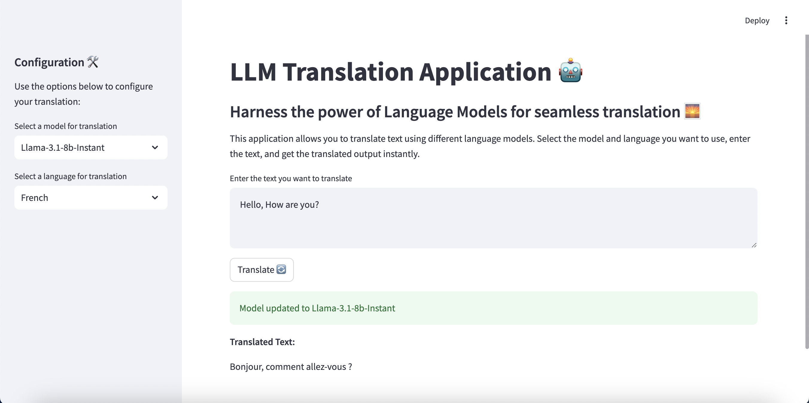
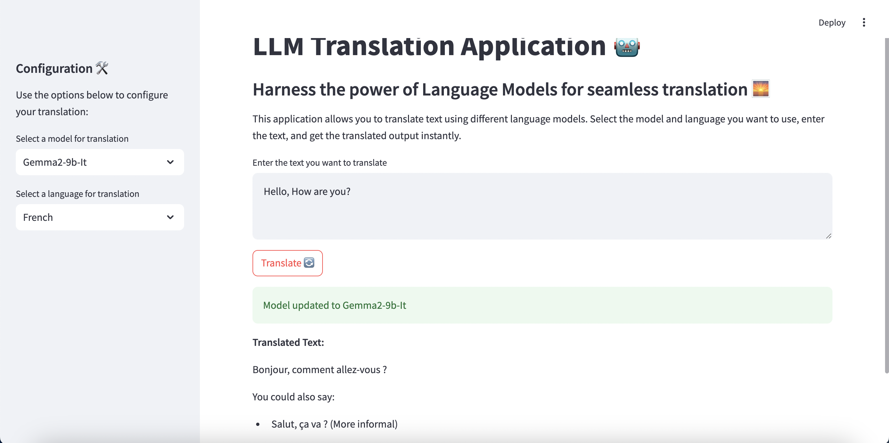
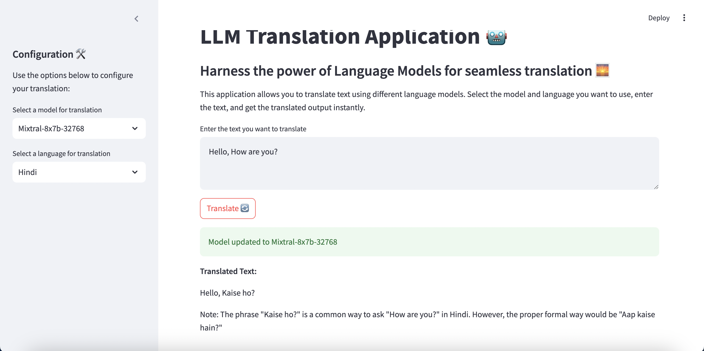
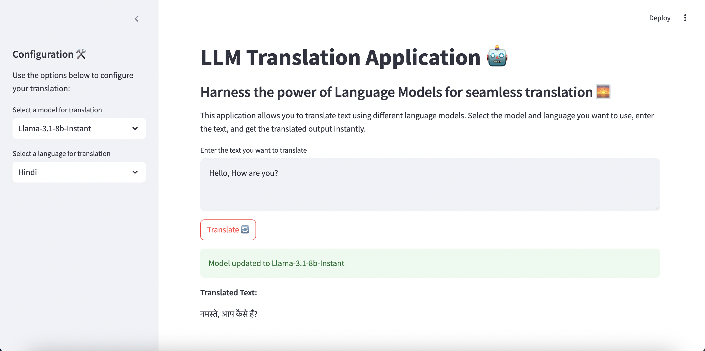

# LLM Translation Application 🤖

This project is a Language Model (LLM) Translation Application that leverages open-source models for translating text into different languages. The project consists of a backend server for handling API requests and a frontend Streamlit application for user interaction. We use Groq to make calls to open-source LLMs.

## Folder Structure 🛠️

1. `requirements.txt`: Contains the list of packages required for the project.
2. `Machine_Translation.ipynb`: A Jupyter Notebook that demonstrates using ChatGroq to call open-source models and check the machine translation logic.
3. `server.py`: Contains the backend code for creating the endpoints.
4. `client.py`: Contains the Streamlit code that uses the created backend API.

## Installation

Follow these steps to set up the project:

1. **Clone the repository**:
    ```bash
    git clone <repository-url>
    cd <repository-directory>
    ```

2. **Create and activate a virtual environment** (optional but recommended):
    ```bash
    python -m venv venv
    source venv/bin/activate  # On Windows, use `venv\Scripts\activate`
    ```

3. **Install the required packages**:
    ```bash
    pip install -r requirements.txt
    ```

## Running the Backend Server

The backend server is responsible for handling API requests for model selection and text translation.

1. **Navigate to the project directory**:
    ```bash
    cd <repository-directory>
    ```

2. **Run the backend server**:
    ```bash
    uvicorn server:app --reload
    ```

    The server will start and should be accessible at `http://127.0.0.1:8001`.

## Running the Streamlit Application

The Streamlit application serves as the frontend for interacting with the translation models.

1. **Navigate to the project directory**:
    ```bash
    cd <repository-directory>
    ```

2. **Run the Streamlit app**:
    ```bash
    streamlit run client.py
    ```

    The app will start and should be accessible at `http://localhost:8501`.

## Usage

1. **Open the Streamlit app** in your browser:
    ```
    http://localhost:8501
    ```

2. **Configure your translation**:
    - Use the sidebar to select a translation model and target language.
    - Enter the text you want to translate in the text area.
    - Click the "Translate" button to get the translated text.

3. **Available Models**:
    - `Llama-3.1-8b-Instant`
    - `Mixtral-8x7b-32768`
    - `Gemma2-9b-It`
    - `Gemma-7b-It`

4. **Available Languages**:
    - French
    - German
    - Spanish
    - Hindi

## API Endpoints

The backend server provides the following endpoints:

1. **Get Available Models**
    - **Endpoint**: `/available_models/`
    - **Method**: `GET`
    - **Description**: Returns the list of available models.

2. **Get Available Languages**
    - **Endpoint**: `/available_languages/`
    - **Method**: `GET`
    - **Description**: Returns the list of available languages.

3. **Update Model**
    - **Endpoint**: `/update_model/`
    - **Method**: `POST`
    - **Request Body**: `{"new_model": "<model_name>"}`
    - **Description**: Updates the model used for translation.
    - **Example**:
        ```json
        {
            "new_model": "Gemma2-9b-It"
        }
        ```

4. **Update Language and Translate Text**
    - **Endpoint**: `/update_language_txt/`
    - **Method**: `POST`
    - **Request Body**: `{"new_language": "<language>", "input_text": "<text>"}`
    - **Description**: Updates the language used for translation and returns the translated text.
    - **Example**:
        ```json
        {
            "new_language": "French",
            "input_text": "Hello, how are you?"
        }
        ```

## Notes

- The `Machine_Translation.ipynb` notebook demonstrates using ChatGroq to call open-source models and validate the machine translation logic.
- Make sure your backend server is running before starting the Streamlit app to ensure the frontend can communicate with the backend API.

## Streamlit APP

 <div style="display: flex; justify-content: space-around;">
  
  
</div>
<br/>
<br/>
 <div style="display: flex; justify-content: space-around;">
  
  
</div>
